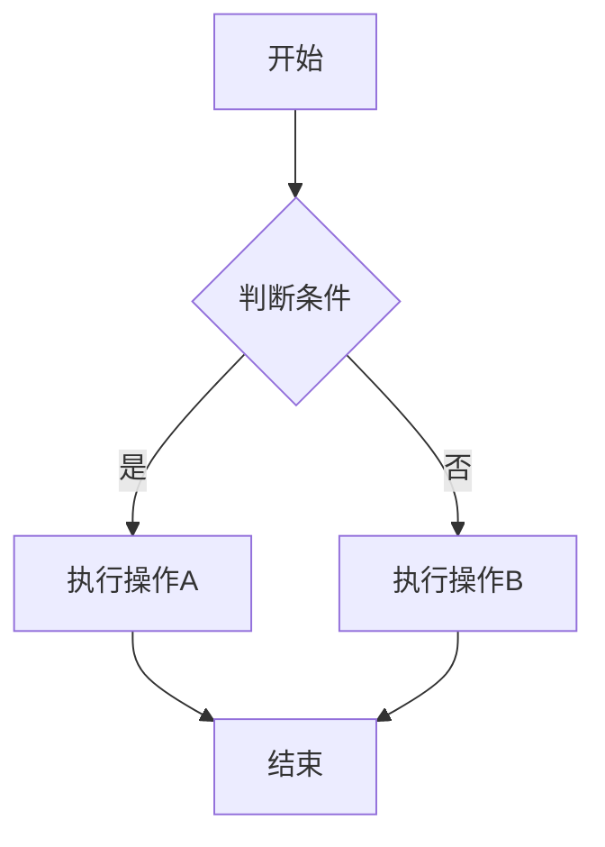
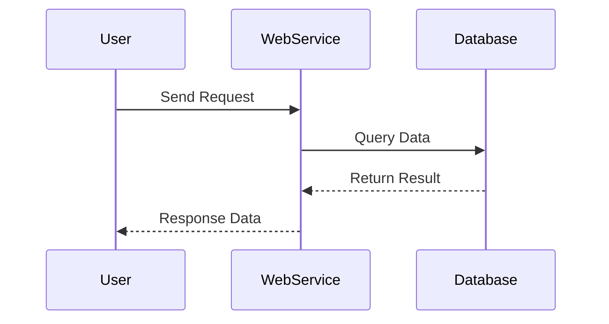
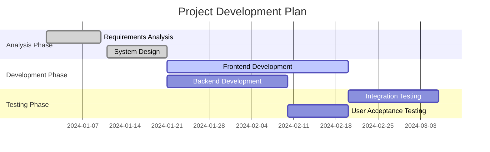
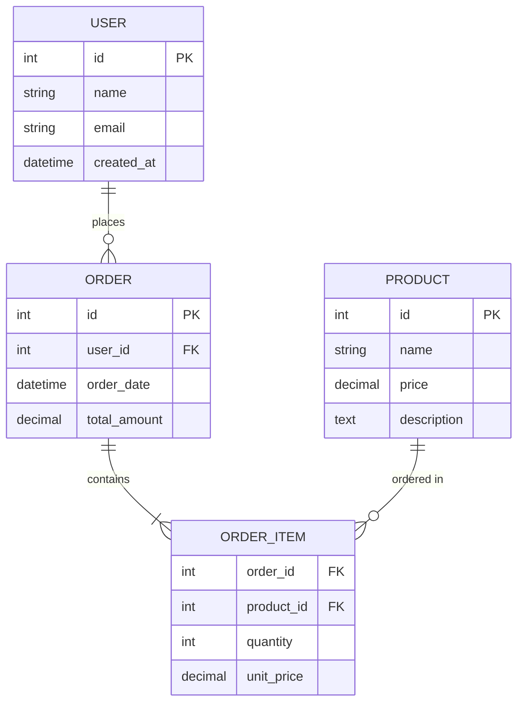
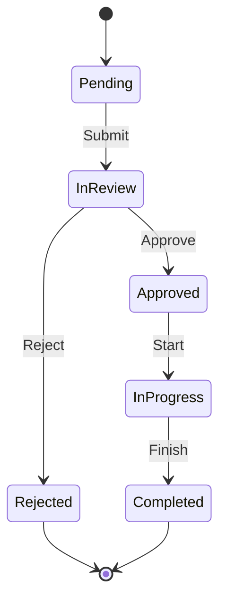
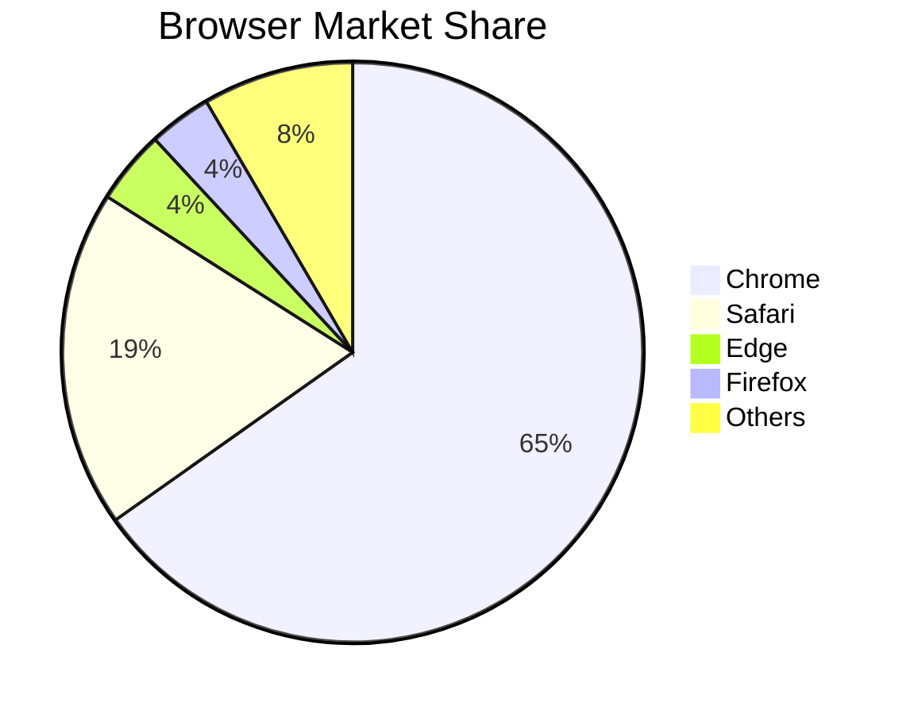
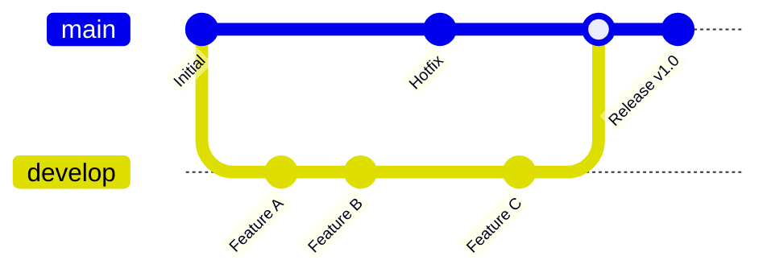
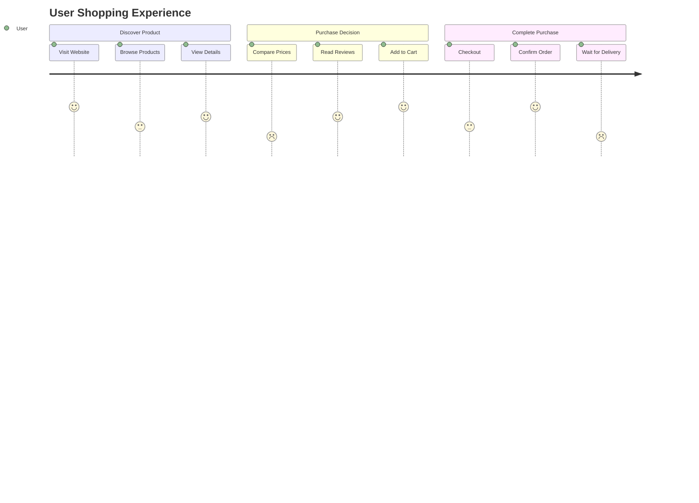

# 测试Mermaid图表

这是一个测试文件，用于展示Markdown服务的Mermaid图表支持功能。

## 流程图

```mermaid
flowchart TD
    A[开始] --> B{判断条件}
    B -->|是| C[执行操作A]
    B -->|否| D[执行操作B]
    C --> E[结束]
    D --> E
```

## 序列图

```mermaid
sequenceDiagram
    participant User
    participant WebService
    participant Database
    
    User->>WebService: Send Request
    WebService->>Database: Query Data
    Database-->>WebService: Return Result
    WebService-->>User: Response Data
```

## 甘特图

```mermaid
gantt
    title Project Development Plan
    dateFormat  YYYY-MM-DD
    section Analysis Phase
    Requirements Analysis    :done,    des1, 2024-01-01,2024-01-10
    System Design           :done,    des2, 2024-01-11, 10d
    section Development Phase
    Frontend Development    :active,  dev1, 2024-01-21, 30d
    Backend Development     :         dev2, after des2, 20d
    section Testing Phase
    Integration Testing     :         test1, after dev1, 15d
    User Acceptance Testing :         test2, after dev2, 10d
```

## 实体关系图

```mermaid
erDiagram
    USER ||--o{ ORDER : places
    ORDER ||--|{ ORDER_ITEM : contains
    PRODUCT ||--o{ ORDER_ITEM : "ordered in"
    
    USER {
        int id PK
        string name
        string email
        datetime created_at
    }
    
    ORDER {
        int id PK
        int user_id FK
        datetime order_date
        decimal total_amount
    }
    
    PRODUCT {
        int id PK
        string name
        decimal price
        text description
    }
    
    ORDER_ITEM {
        int order_id FK
        int product_id FK
        int quantity
        decimal unit_price
    }
```

## 状态图

```mermaid
stateDiagram-v2
    [*] --> Pending
    Pending --> InReview : Submit
    InReview --> Approved : Approve
    InReview --> Rejected : Reject
    Approved --> InProgress : Start
    InProgress --> Completed : Finish
    Rejected --> [*]
    Completed --> [*]
```

## 饼图

```mermaid
pie title Browser Market Share
    "Chrome" : 65.2
    "Safari" : 18.8
    "Edge" : 4.1
    "Firefox" : 3.5
    "Others" : 8.4
```

## Git图

```mermaid
gitGraph
    commit id: "Initial"
    branch develop
    checkout develop
    commit id: "Feature A"
    commit id: "Feature B"
    checkout main
    commit id: "Hotfix"
    checkout develop
    commit id: "Feature C"
    checkout main
    merge develop
    commit id: "Release v1.0"
```

## 用户旅程图

```mermaid
journey
    title User Shopping Experience
    section Discover Product
      Visit Website: 5: User
      Browse Products: 3: User
      View Details: 4: User
    section Purchase Decision
      Compare Prices: 2: User
      Read Reviews: 4: User
      Add to Cart: 5: User
    section Complete Purchase
      Checkout: 3: User
      Confirm Order: 5: User
      Wait for Delivery: 2: User
```

这个测试文件展示了Mermaid支持的多种图表类型，包括流程图、序列图、甘特图、实体关系图、状态图、饼图、Git图和用户旅程图等。